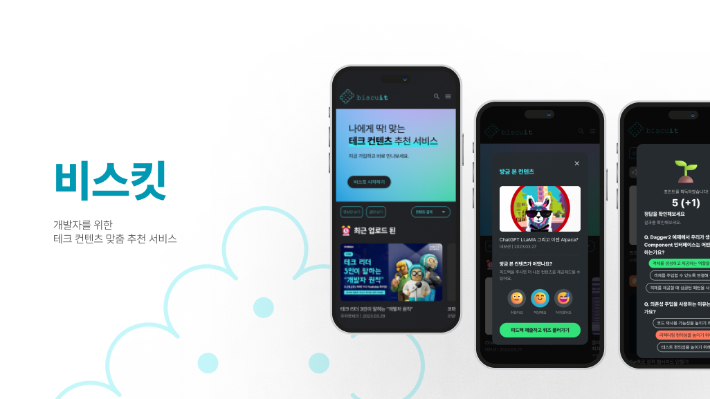

### 📋 프로젝트 개요

> **프로젝트명** : 비스킷   **개발 기간** : 2023년 02월 20일 ~ 2023년 04월 07일 (7주)   **분류** : 팀 프로젝트   **팀 구성** : 프론트엔드 3명, 백엔드 3명   **역할 및 기여도** : 프론트엔드 30%   **사용 기술** : `React`, `TypeScript`, `Recoil`, `React Query`, `Tailwind CSS`, `Styled-Components`

 
 
 

### 🧑‍🤝‍🧑 팀 정보

| 이름   | 역할                            |
| ------ | ------------------------------- |
| 유한별 | 팀장, FE 개발                   |
| 이은지 | FE 개발, UI/UX 디자인, UCC 제작 |
| 박유진 | FE 개발                         |
| 김영빈 | 데이터 분석, BE 개발            |
| 김준호 | 부팀장, BE 개발                 |
| 이지영 | CI/IC, BE 개발                  |

 
 
 

### 🔍 기획 배경

> 우리에게 필요하고 당장 쓸 수 있는 서비스를 만들자!

우리에게 필요한 서비스를 개발하고자, 팀원들이 가지고 있는 기술 컨텐츠에 대한 니즈를 반영하여 기획했습니다.

##### 우리의 Needs

- 출퇴근 시간과 같은 자투리 시간을 활용해 기술 공부를 하고 싶다.
- 다양한 기술 컨텐츠(영상, 글)이 여러 플랫폼에 분산되어 있어 선택하기 어렵다.

##### 솔루션

" 개인 맞춤 큐레이션 "

- 사용자의 시간, 관심 기술, 기술 수준에 맞춰 기술 컨텐츠를 추천

" 정확한 추천 알고리즘 "

- 사용자가 컨텐츠를 보고 나면 해당 컨텐츠에 대한 피드백(난이도)를 받아 추천 정확도 향상

" 게이미피케이션 "

- ChatGPT를 활용한 퀴즈를 통해 학습 효과를 강화
- 잔디 및 포인트를 통해 지속적으로 비스킷을 사용할 동기를 부여

 
 
 

### ⚙️ 핵심 기능

> 기술 컨텐츠 추천

- 비로그인 시에는 최신 컨텐츠와 인기 컨텐츠 및 랜덤 카테고리 컨텐츠가 홈화면에서 추천됩니다.
- 로그인 시에는 사용자의 히스토리와 비슷한 사용자가 본 컨텐츠, 관심 카테고리 컨텐츠가 추천됩니다.

> 퀴즈 및 포인트

- 컨텐츠를 보고 나면 ChatGPT를 통해 생성한 퀴즈가 제공됩니다.
- 로그인한 사용자만 퀴즈의 정답을 확인할 수 있습니다.
- 로그인한 사용자는 맞춘 퀴즈의 갯수만큼 포인트를 획득합니다.

> 대시보드

- 퀴즈를 맞출 때마다 해당 날짜의 잔디가 채워집니다.
- 사용자가 본 컨텐츠들의 카테고리를 분석한 내용을 시각화하여 제공합니다.

 
 
 

### 💡 주요 기능

> ✅ 표시는 제가 담당한 기능입니다.

1.  홈

    - 로그인, 비로그인 각 상태에 따른 컨텐츠 추천

2.  로그인

    - 구글 소셜 로그인
    - 회원가입시 닉네임, 직무, 연차, 관심사 설문조사

3.  퀴즈

    - ✅ 제공된 퀴즈 데이터를 조건에 맞게 가공
    - ✅ 사용자의 선택과 데이터를 비교하여 퀴즈 결과 표시

4.  검색

    - ✅ 검색어에 따른 결과 무한스크롤 구현

5.  카테고리

    - ✅ 카테고리에 따른 결과 무한스크롤 구현

6.  북마크 및 히스토리

    - ✅ 북마크 및 히스토리 무한스크롤 구현

7.  마이페이지

    - 회원정보 수정
    - 대시보드(잔디 및 포인트, 카테고리 리포트) 구현

 
 
 

### 🎨 기능 상세 및 구현 화면

#### 1) 홈

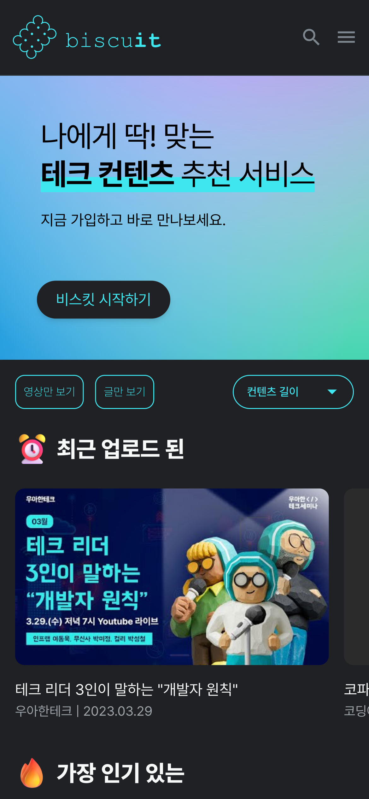 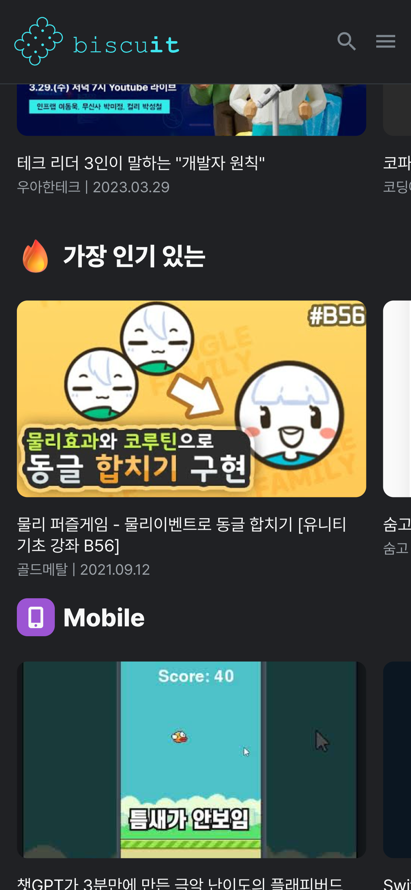 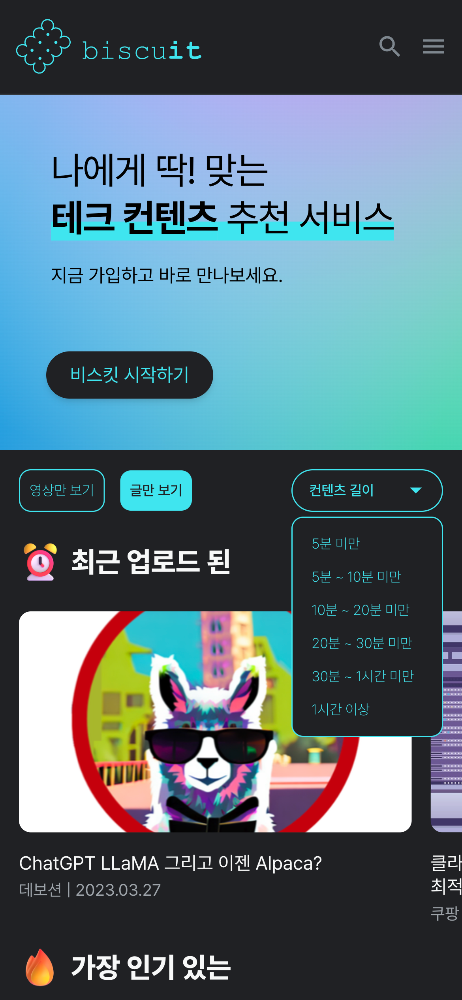

#### 2) 피드백

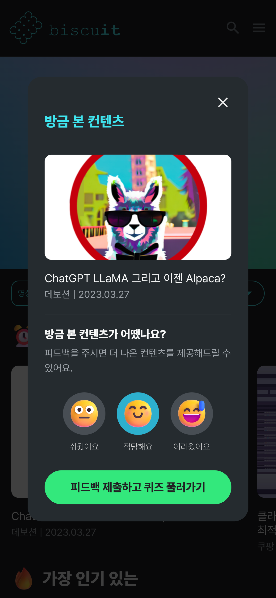

#### 3) 퀴즈

##### 비로그인시

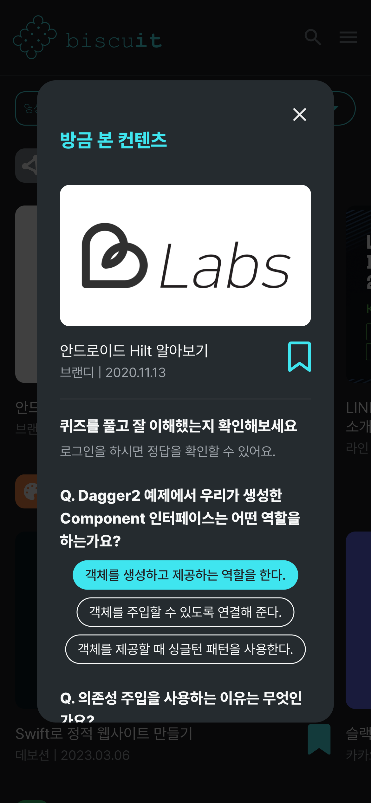 
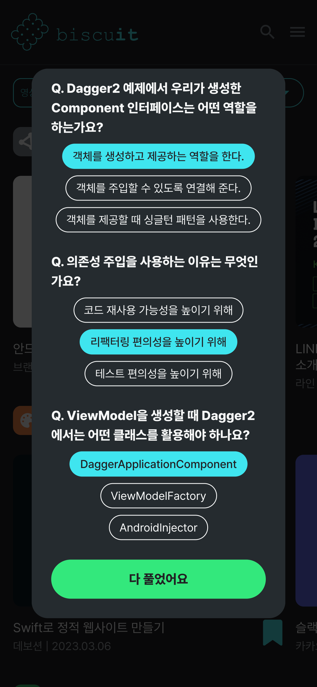

##### 로그인시

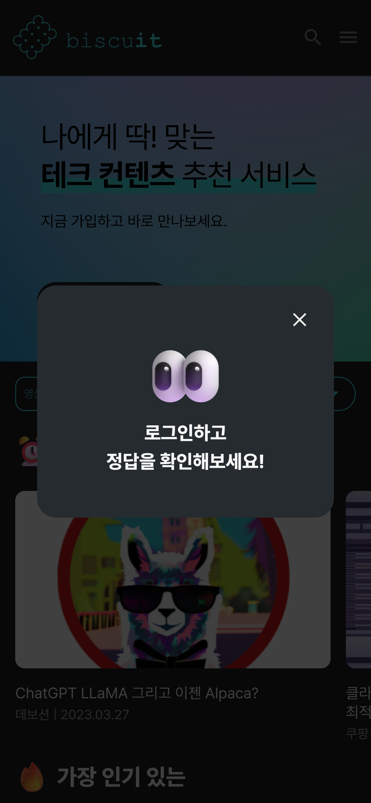 
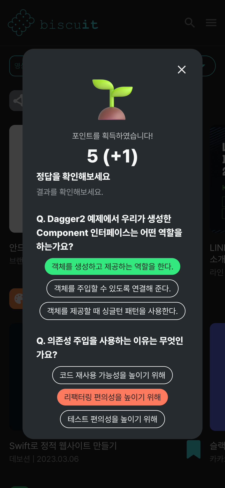 
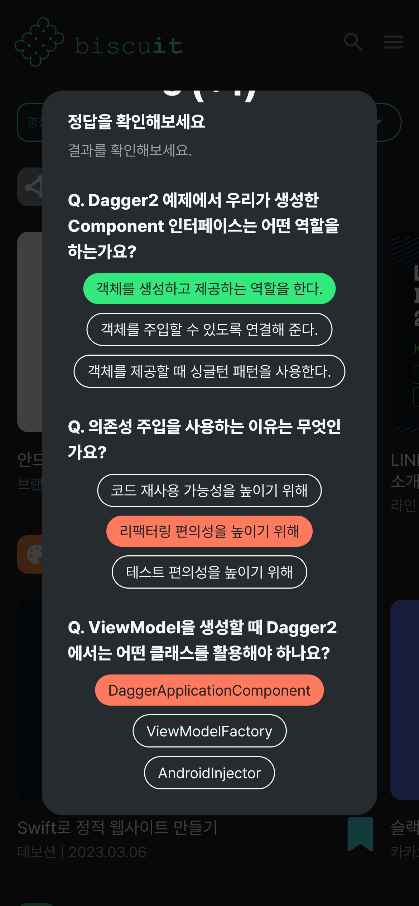

#### 4) 로그인 및 회원가입

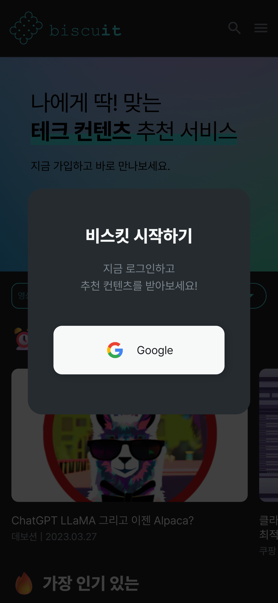
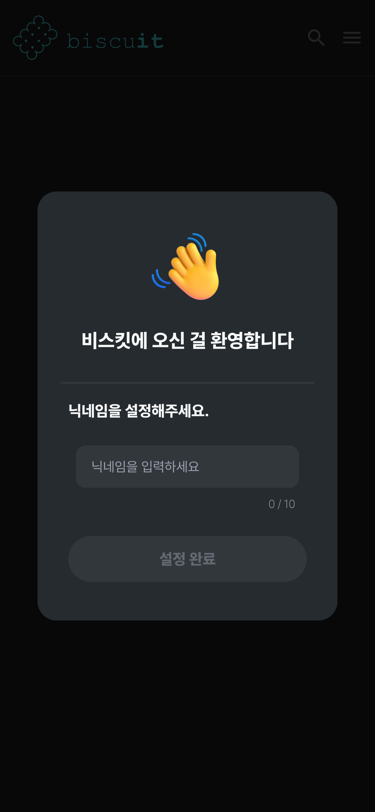
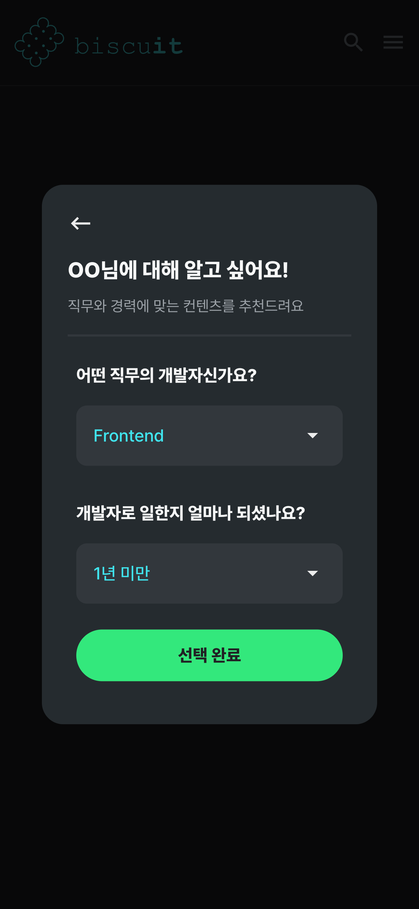
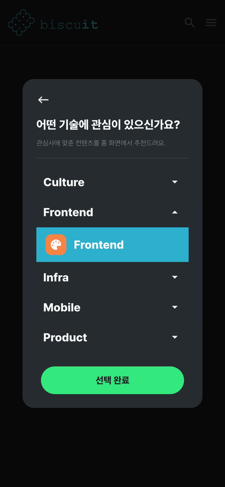

#### 5) 마이페이지

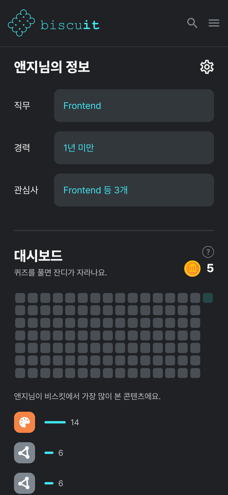
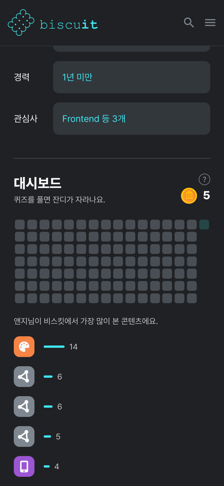
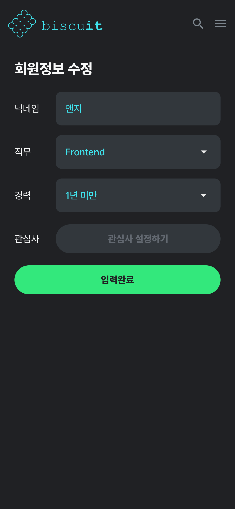

#### 6) 북마크 및 히스토리

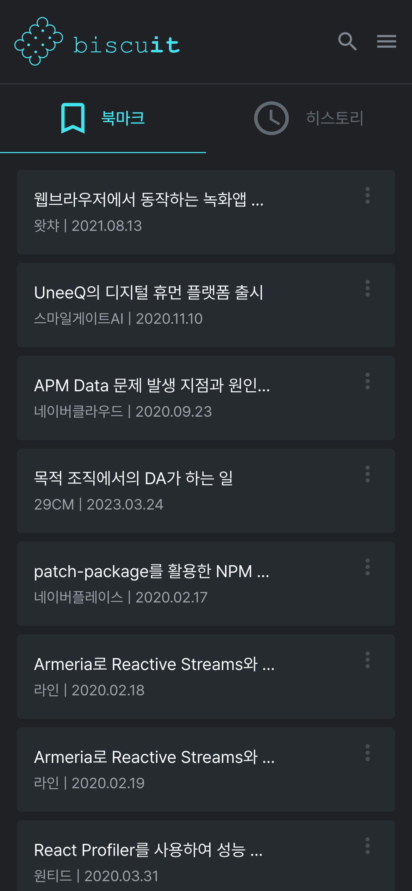
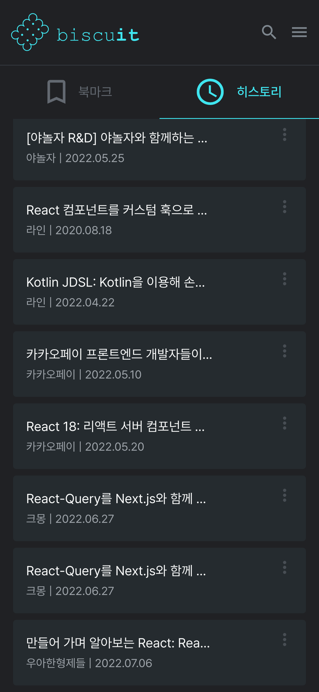

 
 
 

### 💭 프로젝트 회고

### 배운 점

- 기획한 서비스를 직접 구현해나가며 초기에 서비스 설계 단계가 얼마나 중요한지 깨달았다. (컴포넌트 구조 및 API 설계 등의 측면)
- 협업과 유지보수성, 재사용성을 고려한 코드 작성의 중요성을 느꼈다.

### 아쉬운 점

- 기능적으로 미완성인 부분을 완벽히 해결하지 못하고 프로젝트를 마쳐서 아쉽다. 시간이 나면 해당 부분을 리팩토링 해보고 싶다.

 
 
 
 
 
 
 
 
 
 
